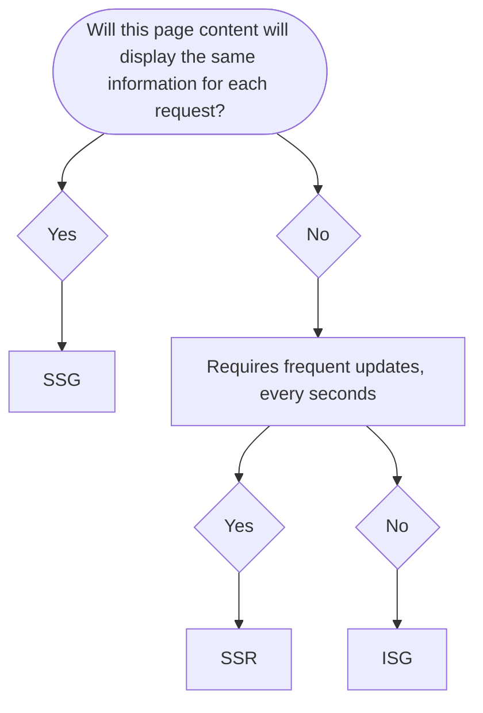

# TechFlow

TechFLow is a mobile friendly web app where user can ask questions on a programming technical topics and gets response from the community.

### Technology Used

1. Next Js

### Project Setup

VS Code Extensions

- Babel JavaScript
- Better Comments
- Catppuccin for VSCode
- ESLint
- IntelliCode
- Material Icon Theme
- npm Intellisense
- Path Intellisense
- Prettier - Code formatter
- Prettier ESLint
- Pretty TypeScript Errors
- Tailwind CSS IntelliSense

### Create Project

Create Project npx create-next-app@latest With following options

- typescript
- tailwind
- app router
- turbopack

### Birth of Server Components

React began with a simple yet powerful premise: build user interfaces using components that live and breathe in the browser. Every React application followed this pattern:

- Initial page load downloads the JavaScript bundle
- React bootstraps itself in the browser
- Components render and become interactive
- The application handles all subsequent user interactions locally

Basically, every React app lived entirely in the browser. Your whole application is downloaded as a bundle of JavaScript, like getting a complete LEGO set dumped on your desk at once.

The turning point came when Meta's own teams struggled with these limitations while building Instagram's web application. They found themselves shipping increasingly large amounts of JavaScript to users browsers. This wasn't just a technical problem - it directly impacted user experience, especially in regions with slower internet connections or less powerful devices.

**Server Components**

- Server Components represent a fundamental shift in how React applications work. Instead of running everything in the browser, components can now run on the server and send only the necessary HTML to the user. This is more than just an optimization - it's a complete rethinking of React's architecture.
- React Server Components (RSC) is a core React feature that Next.js happens to implement exceptionally well.
- Server Components would manage data-heavy, non-interactive parts of the app, leaving only interactive elements to be handled by client components.

**Components**

Client Components: Rendered on client side.

Server Components:

- Rendered on server side.
- Faster initial page load.
- Smaller JS bundle size.
- SEO.

**When to deciede what components to use**

Client Components: User interaction like button clicks, inputs and using react hooks.

Server Components: Fetching data from server, displaying static content.

<mark>Note:</mark>
**Every components are treated as server components**
**`use client` to use as client components**

**Static Rendering**
If a page uses Static Generation, the page HTML is generated at build time. That means in production, the page HTML is generated when you run next build. This HTML will then be reused on each request. It can be cached by a CDN.
**Pre-rendering process includes the Server and Client Components.**

<mark>The client components can only render the client components</mark>

### Runtime Environment

The **Node.js** Runtime: Default runtime that has access to all the nodejs API and ecosystem.

The **Edge** Runtime: A lightweight runtime based on Web API's with support to a limited subset of Node.js API's.

Setting runtime:
`export const runtime = 'edge' // 'nodejs'`

### Rendering Strategies

1. Static Site Generation (SSG) - Build time
2. Incremental Static Generation (ISG)
3. Server-Side Rendering (SSR) - on a request to a server

**Static site generation** is where your HTML is generated at build time. This HTML is then used for each request. Static site generation is probably the best type of rendering strategy for SEO as not only do you have all the HTML on page load because it's pre-rendered, but it also helps with page performance – now another ranking factor when it comes to SEO.

**Server-Side Rendering (SSR)** is pre-rendered, which also makes it great for SEO. Instead of being generated at build time, as in SSG, SSR's HTML is generated at request time. This is great for when you have pages that are very dynamic.

**Incremental Static Regeneration:**
If you have a very large amount of pages, generating them all at build time may not be feasible. Next.js allows you to create or update static pages after you have built your site. It enables developers and content editors to use static generation on a per-page basis, without needing to rebuild the entire site. With ISR, you can retain the benefits of static while scaling to millions of pages.

**Client Side Rendering (CSR):**
Client-Side Rendering allows developers to make their websites entirely rendered in the browser with JavaScript. On initial page load a single HTML file is generally served with little to no content until you fetch the JavaScript and the browser compiles everything.

In general Client-Side Rendering is not recommended for optimal SEO.

CSR is perfect for data heavy dashboards, account pages or any page that you do not require to be in any search engine index.

**When to use**

