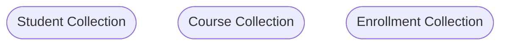

# TechFlow

TechFLow is a mobile friendly web app where user can ask questions on a programming technical topics and gets response from the community.

### Technology Used

1. Next Js
2. Shadcn for UI Components
3. Tailwind CSS for Styling
4. React Hook Form
5. Zod for schema declaration and validation
6. mongodb - Database

### Package Used

1. `next-themes`: For dark and light mode theme.
2. AuthJS for authentication.
3. `query-string`
4. MDXEditor for Markdown editor.
5. `mongoose`: Mongoose is an Object Data Modeling (ODM) library for MongoDB and Node.js.
6. `pino` & `pino-pretty`: Logger and prettier.
7. `slugify`: to construct username of Users.

### Regular Expressions

https://www.programiz.com/javascript/regex

### Project Setup

VS Code Extensions

- Babel JavaScript
- Better Comments
- Catppuccin for VSCode
- ESLint
- IntelliCode
- Material Icon Theme
- npm Intellisense
- Path Intellisense
- Prettier - Code formatter
- Prettier ESLint
- Pretty TypeScript Errors
- Tailwind CSS IntelliSense

### Create Project

Create Project npx create-next-app@latest With following options

- typescript
- tailwind
- app router
- turbopack

### Birth of Server Components

React began with a simple yet powerful premise: build user interfaces using components that live and breathe in the browser. Every React application followed this pattern:

- Initial page load downloads the JavaScript bundle
- React bootstraps itself in the browser
- Components render and become interactive
- The application handles all subsequent user interactions locally

Basically, every React app lived entirely in the browser. Your whole application is downloaded as a bundle of JavaScript, like getting a complete LEGO set dumped on your desk at once.

The turning point came when Meta's own teams struggled with these limitations while building Instagram's web application. They found themselves shipping increasingly large amounts of JavaScript to users browsers. This wasn't just a technical problem - it directly impacted user experience, especially in regions with slower internet connections or less powerful devices.

**Server Components**

- Server Components represent a fundamental shift in how React applications work. Instead of running everything in the browser, components can now run on the server and send only the necessary HTML to the user. This is more than just an optimization - it's a complete rethinking of React's architecture.
- React Server Components (RSC) is a core React feature that Next.js happens to implement exceptionally well.
- Server Components would manage data-heavy, non-interactive parts of the app, leaving only interactive elements to be handled by client components.

**Components**

Client Components: Rendered on client side.

Server Components:

- Rendered on server side.
- Faster initial page load.
- Smaller JS bundle size.
- SEO.

**When to deciede what components to use**

Client Components: User interaction like button clicks, inputs and using react hooks.

Server Components: Fetching data from server, displaying static content.

<mark>Note:</mark>
**Every components are treated as server components**
**`use client` to use as client components**

**Static Rendering**
If a page uses Static Generation, the page HTML is generated at build time. That means in production, the page HTML is generated when you run next build. This HTML will then be reused on each request. It can be cached by a CDN.
**Pre-rendering process includes the Server and Client Components.**

<mark>The client components can only render the client components</mark>

### Runtime Environment

The **Node.js** Runtime: Default runtime that has access to all the nodejs API and ecosystem.

The **Edge** Runtime: A lightweight runtime based on Web API's with support to a limited subset of Node.js API's.

Setting runtime:
`export const runtime = 'edge' // 'nodejs'`

### Rendering Strategies

1. Static Site Generation (SSG) - Build time
2. Incremental Static Generation (ISG)
3. Server-Side Rendering (SSR) - on a request to a server

**Static site generation** is where your HTML is generated at build time. This HTML is then used for each request. Static site generation is probably the best type of rendering strategy for SEO as not only do you have all the HTML on page load because it's pre-rendered, but it also helps with page performance – now another ranking factor when it comes to SEO.

**Server-Side Rendering (SSR)** is pre-rendered, which also makes it great for SEO. Instead of being generated at build time, as in SSG, SSR's HTML is generated at request time. This is great for when you have pages that are very dynamic.

**Incremental Static Regeneration:**
If you have a very large amount of pages, generating them all at build time may not be feasible. Next.js allows you to create or update static pages after you have built your site. It enables developers and content editors to use static generation on a per-page basis, without needing to rebuild the entire site. With ISR, you can retain the benefits of static while scaling to millions of pages.

**Client Side Rendering (CSR):**
Client-Side Rendering allows developers to make their websites entirely rendered in the browser with JavaScript. On initial page load a single HTML file is generally served with little to no content until you fetch the JavaScript and the browser compiles everything.

In general Client-Side Rendering is not recommended for optimal SEO.

CSR is perfect for data heavy dashboards, account pages or any page that you do not require to be in any search engine index.

**When to use**


### Hydration

Hydration in Next.js is the process where the client-side JavaScript takes over the server-rendered HTML to make it interactive. It attaches event listeners and other interactive behaviors to the static HTML, allowing React to update the DOM and respond to user interactions without re-rendering the entire page.

### Tailwind

**Screen Sizes**

`sm`: width >= 640px

`max-sm`: width < 640px

### HTTP State Managment Mechanisms

HTTP is a stateless protocol, meaning it does not maintain state between requests. However, web applications often require maintaining state to manage user sessions, track user preferences, and personalize user experiences.

To address this, various state management mechanisms have been developed, including cookies, local storage, session storage, and more.

**Cookies**

Cookies are small pieces of data stored in the user's web browser by the server. They are commonly used for session management, tracking user preferences, and personalizing user experiences.

Client sends cookies with every request to the same server, allowing the server to identify the user and maintain state across requests. It happens automatically once the cookie is set by the server making it a convenient way to manage user sessions.

**Local Storage**

Local storage is a web storage mechanism that allows data to be stored in the user's web browser. It provides a simple key-value storage interface and is commonly used for persisting user preferences, caching data, and storing application state.

It provides a larger storage capacity than cookies (typically up to 5-10MB per domain) and is accessible via JavaScript APIs.

Local storage is commonly used for caching static assets, storing user preferences, and offline data storage in progressive web applications (PWAs).

**Session Storage**

Session storage is similar to local storage but is cleared when the user's session ends (i.e., when the browser is closed). It is commonly used for storing temporary data that should not persist across sessions.

Using session storage can help improve security by ensuring that sensitive data is not stored beyond the user's session.

It is often used for temporary data storage, such as form data and shopping cart items, that should not persist across browser sessions

**IndexedDB**

IndexedDB is a low-level API for client-side storage of significant amounts of structured data, including files/blobs.

It provides a more powerful and flexible storage solution compared to local storage and session storage but requires more complex programming logic.

It is commonly used for storing large datasets, offline data synchronization, and complex data querying in web applications.

### Different ways of Storing Sessions for Authorization

**What's Session Token?**

A session token is a unique identifier used to authenticate a user's session. It is typically generated during the authentication process and is used to associate a user with their session data on the server.

It's a common practice to store session tokens on the client side and send them with each request to authenticate the user.

Do keep in mind that session tokens are not associated with session based authentication only, they can be used with token based authentication as well in the form of bearer tokens like JSON Web Tokens (JWT).

1. Cookies: Session tokens are often stored as cookies on the client's browser. The server sets a cookie containing the session token during the authentication process, and the client automatically sends this cookie with each subsequent request.

2. Authorization headers (Bearer tokens): Bearer tokens, such as JSON Web Tokens (JWT), are another common method for storing session tokens. After successful authentication, the server generates a token containing user information and signs it. This token is then sent to the client, typically in the response body, and the client includes it in the Authorization header of subsequent requests.

and many more.

### State Management

State management is akin to keeping track of data and events in an application, similar to remembering scores in a video game.

**Local State Management:** refers to managing data within a single component (e.g., using a useState hook).

**Global State Management:** allows data to be accessed and modified by multiple components, often utilizing a centralized store or context. The Context API is a common way to implement global state management in React. Other libraries for state management include Redux, Zustand, Recoil, and MobX, each serving different needs and complexities.

**NOTE:**
Redux, Context API, Zustand, and others are all hook-based patterns, we can't use them on the server side.

Solution is URL State Management.

### URL State Management

A URL (Uniform Resource Locator) with parameters typically consists of several components:

**Scheme**: Specifies the protocol used to access the resource, such as http:// or https://.

**Domain**: The domain name or IP address of the server hosting the resource.

**Port**: (Optional) Specifies the port number to which the request should be sent. Default ports are often omitted (e.g., port 80 for HTTP, port 443 for HTTPS).

**Path**: The specific resource or endpoint on the server, typically represented as a series of directories and filenames.

**Query Parameters**: (Also known as `searchParams` in Next.js) Additional data sent to the server as part of the request, typically used for filtering or modifying the requested resource. Query parameters are appended to the URL after a question mark "?" and separated by ampersands "&"

For example: ?param1=value1¶m2=value2

**Fragment**: (Optional) Specifies a specific section within the requested resource, often used in web pages to navigate to a particular section. It is indicated by a hash "#" followed by the fragment identifier.

**Example**

**SERVER SIDE**

```js
async function Page({ params, searchParams }) {
  const { id } = await params;
  const { page, filter } = await searchParmas;

  return <h1>My Page</h1>;
}
export default Page;
```

Hooks Next.js provides two specific hooks, namely useParams and useSearchParams, to retrieve the respective information from the URL.

**CLIENT SIDE**

```js
"use client";

import { useParams } from "next/navigation";

function ExampleClientComponent() {
  const params = useParams();
  const searchParams = useSearchParams();
  const type = searchParams.get("type");

  return <p>Example Client Component</p>;
}

export default ExampleClientComponent;
```

I. Forming URL with Query
**SERVER SIDE**

```js
<Link
  href={{
    pathname: "/jobs",
    query: { type: "softwaredeveloper" },
  }}
>
  All Jobs
</Link>
```

II. Forming URL with Query
**CLIENT SIDE**

```js
const router = useRouter();

const handleButtonClick = () => {
  router.push({
    pathname: "/search",
    query: { q: "your_search_query_here" },
  });
};
```

**III. PROGRAMATICALLY**

```js
const handleButtonClick = () => {
  const searchParams = new URLSearchParams(window.location.search);
  searchParams.set("q", "your_search_query_here");

  window.location.href = `${
    window.location.pathname
  }?${searchParams.toString()}`;
};
```

**IV. Via Package**
`query-string`: Parse and stringify URL query strings

**NOTE:**

1. Using hooks would mean turning that component into a client component.
2. If the component is near its parent Page, then instead of opting for these hooks, you can pass `params` and `searchParams` of Page props to its respective children. A bit of prop drilling won’t hurt.

### Web and Application Server

A web server is a software component that delivers static data like images, files, and text in response to client requests. An application server adds business logic to compute the web server's response. Both terms are used **synonymously**, and the most popular server software solutions today are hybrid web application servers.

### Alternative of Moongose

1. Mongoose: Schema, Validation and ORM. Best for complex apps that needs strong consistency.
2. MongoDB Native Driver: High flexibility and direct control over MongoDB. Best for light weight apps that don't need strict data rules.
3. Prisma ORM: Best for SQL.
4. Drizzle ORM: Best for SQL.

### Mongo DB Database Creation Choices

Choosing between using an array of references and creating multiple collections in MongoDB depends on the specific requirement of application.

**Use Array of References when:**

1. Many to Many Relationship exists.
2. Frequent queries on related data.
3. Lightweight relatioship.

Example:


Student points to the course collection and has an reference.

Cons:

- Can lead to large document if array grows.
- Requires extra query to resolve references.

To fix these cons, use **Multiple Collections**

**Use Multiple Collections when:**

1. Complex Relationships.
2. Data can be managed independently.
3. Flexibility and Scalability.

Example:



They all are independent. The Enrollment collection contain `student_id` and `course_id`.

Cons:

- Requries more complex queries.

### Serverless

The term “serverless” might sound like there are no servers involved, servers do exist—they are just fully managed by a cloud provider, abstracted away from you, developers. But why this abstraction? This abstraction allows you to focus on writing application logic while cloud providers handle infrastructure, scaling, and maintenance of your backend.

You write code, and Cloud providers like AWS, Google Cloud, Azure, or Vercel handle everything else for you.

### Route Handler (API)

https://github.com/JavaScript-Mastery-Pro/ultimate-nextjs_route-handlers

### Response or NextResponse

When returning data from Route Handlers in Next.js, you have two main options: new Response and NextResponse.

**Response** is part of the Web API and is the standard way to create response objects in JavaScript

Use Response when:

- You want to stick closely to Web standards
- You're writing code that might be used in other contexts outside of Next.js
- You need to create a response with a specific body and headers without any Next.js-specific features

```js
export async function GET() {
  return new Response(JSON.stringify({ message: "Hello" }), {
    status: 200,
    headers: {
      "Content-Type": "application/json",
    },
  });
}
```

**NextResponse** is a Next.js utility that extends the standard Response object with additional features specific to Next.js.

Use NextResponse when:

- You want to take advantage of Next.js-specific features
- You need to manipulate cookies or rewrite URLs
- You want to use convenience methods for common tasks

### Zod

- Zod .parse: Throws an error if validation fails. This is useful when you want to immediately stop execution and handle the error centrally, such as within a middleware or a try-catch block.
- Zod .safeParse: Does not error, but returns an object with a success boolean property and, based on that, either the validated data or the validation error.

### API Route vs Server Actions

API Routes are Versatile, which is a great choice for traditional REST-like API endpoints instead of spending ages of time building our own backend. But that isn’t the only way.

Server Actions, introduced in React 19 and supported in the Next.js App Router, represent a fresh approach to backend logic. They allow you to call async functions executed on the server directly from \*\*client components, offering a streamlined way to handle server-side operations.

**When to use Server Actions**

Simple: Server Actions are ideal for apps that require real-time updates, secure operations, and frequent data mutations (e.g., e-commerce and financial apps). They’re also suited for complex server-side calculations.

However, they aren't suitable for public APIs, long-running tasks, video processing, chats, cross-origin requests, stateful operations, or large file uploads.

### Security Concerns

### Myth 1: Server Actions are vulnerable to CSRF attacks.

Reality: Server Actions in Next.js have robust built-in protection against CSRF attacks.

**How to ensure security**

Rely on the built-in CSRF protection provided by Next.js.

For large applications with complex architectures, use the serverActions.allowedOrigins configuration in next.config.js to specify a list of trusted origins.

```js
// next.config.js
module.exports = {
  experimental: {
    serverActions: {
      allowedOrigins: ["my-trusted-domain.com", "*.my-trusted-domain.com"],
    },
  },
};
```

### Myth 2: Sensitive data can be easily leaked through Server Actions

Reality: Next.js carefully handles errors to prevent leaking sensitive information.

**How to ensure security**

Always run your application in production mode when deployed.

Implement proper error handling in your Server Actions:

```js
"use server";

import { logger } from "./logger";

export async function sensitiveOperation() {
  try {
    // Perform sensitive operation
  } catch (error) {
    // Log the full error server-side
    logger.error("Sensitive operation failed", { error });
    // Return a generic error message to the client
    throw new Error("An error occurred. Please try again later.");
  }
}
```

### Myth 3: Server Actions can be easily tampered with on the client side

Reality: Next.js implements several security measures to prevent tampering with Server Actions.

**How to ensure security**

Keep your Next.js version up to date to benefit from the latest security enhancements.

Implement proper authentication and authorization checks in your Server Actions

```js
"use server";

import { getServerSession } from "next-auth/next";
import { authOptions } from "./auth";

export async function updateUserProfile(userId: string, data: UserProfileData) {
  const session = await getServerSession(authOptions);
  if (!session || session.user.id !== userId) {
    throw new Error("Unauthorized");
  }

  // Proceed with profile update
  // ...
}
```

### Myth 4: Server Actions lack proper input validation

Reality: While Server Actions don't automatically validate all inputs, they provide a clear context for implementing robust input validation.

**How to ensure security**

Always validate and sanitize all inputs to your Server Actions.

Use a validation library like Zod or Yup for type-safe validation

```js
"use server";

import { z } from "zod";

const userSchema = z.object({
  name: z.string().min(2).max(50),
  email: z.string().email(),
  age: z.number().int().positive().optional(),
});

export async function createUser(formData: FormData) {
  const rawData = Object.fromEntries(formData);

  try {
    const validatedData = userSchema.parse(rawData);
    // Proceed with user creation using validatedData
  } catch (error) {
    if (error instanceof z.ZodError) {
      // Handle validation errors
      throw new Error("Invalid input data");
    }
    throw error;
  }
}
```

Implement additional security measures like rate limiting to prevent abuse

```js
"use server";

import { rateLimit } from "./rate-limiter";

const limiter = rateLimit({
  interval: 60 * 1000, // 1 minute
  uniqueTokenPerInterval: 500, // Max 500 users per second
});

export async function createUser(formData: FormData) {
  try {
    await limiter.check(10, "CREATE_USER_ACTION"); // 10 requests per minute
    // Proceed with user creation
  } catch {
    throw new Error("Rate limit exceeded");
  }
}
```

### API Routes and Server Actions - which one to use and when

Now that you're familiar with both API Routes and Server Actions in Next.js, you might be wondering which one to use and when. Let’s explore the differences between them and understand the scenarios where each approach is the best fit, as there isn’t a one-size-fits-all answer.

1. Framework Integration

Server Actions: Deeply integrated with React and Next.js App Router. They work seamlessly with React Server Components and can be called directly from your components.

API Routes: More standalone. They function as independent endpoints and can be used with any front-end, not just React.

2. Request Handling

Server Actions: Automatically handle form submissions and can be triggered by React events. They don't require manual request parsing.

API Routes: Require explicit handling of different HTTP methods (GET, POST, etc.) and manual parsing of request bodies. You’ve more control over the HTTP layer.

3. Client-Side Usage

Server Actions: These can be used directly in forms or called functions from client components. They integrate naturally with React's useTransition for optimistic updates.

API Routes: These require explicit fetch calls from the client and are often wrapped in custom hooks or data-fetching libraries. Remember fetchHandler?

4. Error Handling

Server Actions: Errors are propagated through React's error boundary system, making them easier to handle within your React component tree.

API Routes: Errors need to be explicitly handled in the API route and then again on the client side after the fetch request.

5. TypeScript Integration

Server Actions: When used with TypeScript, the server and client benefit from end-to-end type safety because they are part of the same TypeScript project.

API Routes: While they can use TypeScript, there's often a disconnect between the API types and the client usage, requiring manual type synchronization. Remember how we had to create separate SuccessResponse and ErrorResponse types to be the type of NextResponse on the API side?

6. Caching and Static Generation

Server Actions: They work well with Next.js's static and dynamic rendering modes, allowing for more granular control over what is rendered on the server compared to the client.

API Routes: They are always dynamic by default and require additional setup to work with static generation or incremental static regeneration. However, they offer a lot to do with caching per specific route.

7. Progressive Enhancement

Server Actions: Support progressive enhancement out of the box. Forms using Server Actions work even if JavaScript is disabled on the client.

API Routes: Require client-side JavaScript to function, as they depend on fetch calls.

8. External API Creation

Server Actions: These are not suitable for creating APIs for external consumption. They're designed for internal use within your Next.js application.

API Routes: Ideal for creating APIs that can be consumed by external services, mobile apps, or other front-ends.

9. Performance Optimization

Server Actions: These can be more performant for simple operations as they reduce the overhead of creating separate API endpoints and allow for more efficient server-client communication.

API Routes: This may introduce slight overhead due to the additional network request, but it can be more efficient for complex operations that benefit from being isolated.

10. Streaming and Partial Rendering

Server Actions: Support React's streaming and Suspense features, which allow for partial page updates and improve perceived performance.

API Routes: Don't inherently support streaming. Any streaming must be manually implemented and managed.

NOTE: By considering these factors, you can make a more informed decision about whether to use Server Actions or API Routes in your Next.js project. Remember, the best choice often depends on your specific use case, project architecture, and performance requirements.
